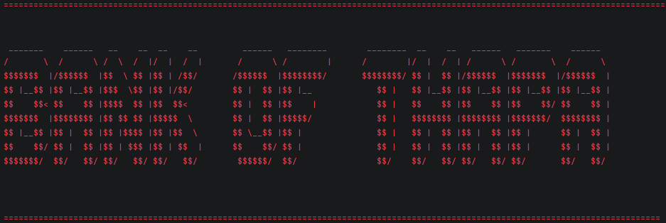
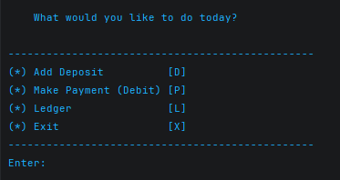
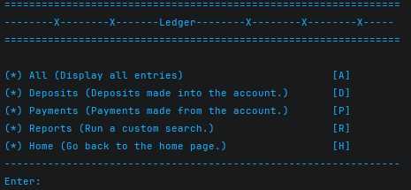
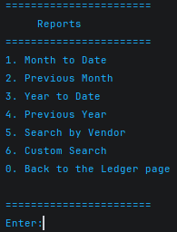
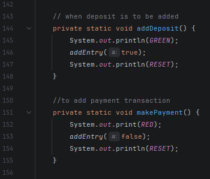

# Bank of Thapa Ledger Application


A console-based banking ledger application built in Java.  
This application allows users to record deposits and payments, store transactions in a CSV file, and generate reports from transaction history.

---

## Features

### Main Menu 🧭
Users can:

- **Add Deposit**
- **Make Payment (Debit)**
- **View Ledger**
- **Exit Application**


---

## Ledger Features 💾

Inside the ledger, users can:

- View **all transactions**
- View only **deposits**
- View only **payments**
- Run reports
- Return to home screen



Transactions are automatically sorted twice by:

- Most recent **date**
- Most recent **time**

In order to get the latest transactions first.

---

## Reports Menu 📈

Users can generate the following reports:

1. Month to Date
2. Previous Month
3. Year to Date
4. Previous Year
5. Search by Vendor



---

## Transaction Data 📊

Transactions are stored in:

```text
src/main/resources/transactions.csv
```

CSV format:

```text
date|time|description|vendor|amount
```

Example:

```text
2026-04-29|14:30:00|Coffee Purchase|Starbucks|-5.75
2026-04-29|09:00:00|Paycheck|Employer|1500.00
```

---

## Technologies Used 🛠

- Java 17
- IntelliJ IDEA Community Edition
- File I/O
    - FileReader
    - BufferedReader
    - FileWriter
    - BufferedWriter
- ArrayList
- Comparator
- LocalDate
- LocalTime

---

## Project Structure 🧱

```text
src
 ┣ main
 ┃ ┣ java/com/pluralsight
 ┃ ┃ ┣ Main.java
 ┃ ┃ ┗ Transaction.java
 ┃ ┗ resources
 ┃   ┗ transactions.csv
```

---

## How to Run ▶️

1. Clone repository:

```
git clone https://github.com/utsav-thapa/capstone-1
```

2. Open project in IntelliJ

3. Run:

```
Main.java
```

Or in IntelliJ use:

- **Ctrl + Shift + F10** to run current file

---

## Favorite Code Block



---

## Future Improvements 

Planned improvements:

- Custom search by:
    - Start Date
    - End Date
    - Description
    - Vendor
    - Amount
- Delete transactions
- Export reports
- Better exception handling for invalid user input

---

## Author

Created by **Utsav Thapa**